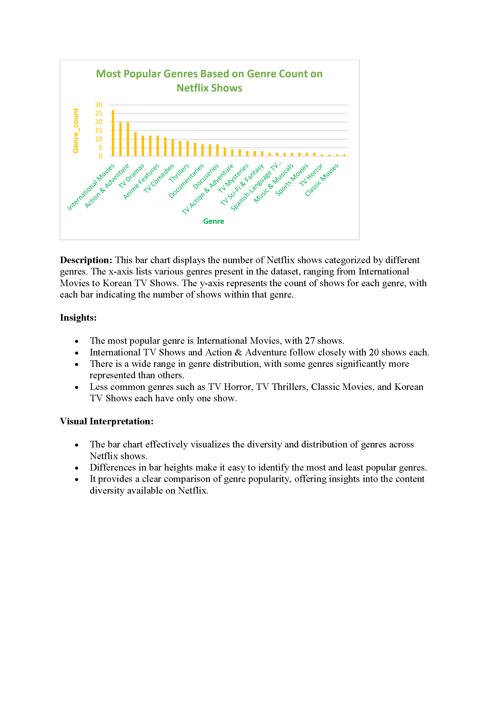
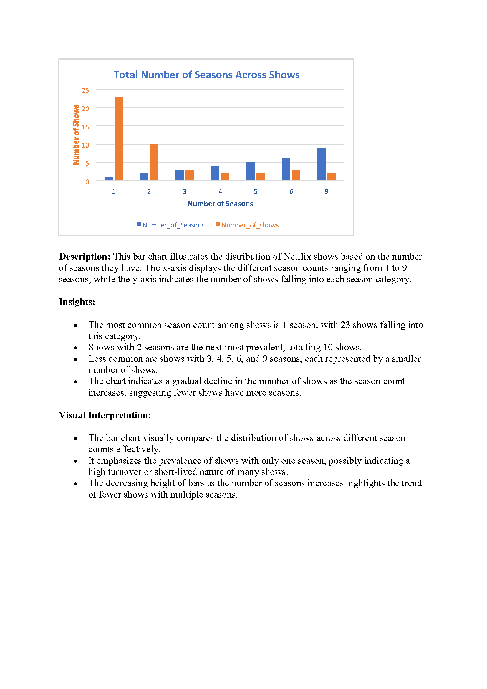

# Netflix Shows Dataset Analysis

## Overview

This repository contains SQL queries and documentation for analyzing the Netflix Shows dataset using MySQL Workbench.

### Dataset

- **Dataset:** Netflix Shows
- **Source:** [Download Dataset](https://drive.google.com/file/d/1Cth8F5M7smd4uqE7QNX6vHBSOdK_eank/view)

## SQL Queries and Documentation

### Step 1: Data Dive

#### Importing the Dataset into MySQL Workbench

## Create Database:

CREATE DATABASE netflix_shows_db;

USE netflix_shows_db;

## Import Dataset:

- Used the "Table Data Import Wizard" in MySQL Workbench to import the CSV file into a table named netflix_shows.

### Difficulties Encountered and Interesting Observations

**Difficulties:**
- Initially faced issues with CSV file format and column structure mismatch.
- Resolved by adjusting table structure using ALTER TABLE to match CSV columns.

**Interesting Observation:**
- Noted a diverse range of genres and significant production from the United States.

## Step 2: Data Fun

## Simple SQL Queries

## Total Number of Shows:

SELECT COUNT(*) AS total_shows FROM netflix_shows;

- **Result:** 100

## Average Duration of Shows:

SELECT AVG(CAST(SUBSTRING_INDEX(duration, ' ', 1) AS DECIMAL(10,2))) AS average_duration

FROM netflix_shows

WHERE duration LIKE '%min%';

- **Result:** 100.73 minutes

## Total Number of Seasons:

SELECT SUM(CAST(SUBSTRING_INDEX(duration, ' ', 1) AS UNSIGNED)) AS total_seasons

FROM netflix_shows

WHERE duration LIKE '%season%';

- **Result:** 106

## Cool Facts Found

- **Fact 1:** The dataset includes exactly 100 shows.
- **Fact 2:** The average duration of shows in the dataset is approximately 100.73 minutes.
- **Fact 3:** There are a total of 106 seasons represented across all shows in the dataset.

## Step 3: Ask Away

## Formulated Questions and Answers

**Question 1: What are the most popular genres?**

I used the following SQL query to accurately analyze and identify the most popular genres among Netflix shows

 - Create a temporary table to hold split genre entries
CREATE TEMPORARY TABLE split_genres (genre VARCHAR(255));

- Insert each genre individually
INSERT INTO split_genres (genre)
SELECT TRIM(SUBSTRING_INDEX(SUBSTRING_INDEX(listed_in, ',', numbers.n), ',', -1)) as genre
FROM netflix_shows
JOIN (
    SELECT 1 n UNION ALL SELECT 2 UNION ALL SELECT 3 UNION ALL SELECT 4
    UNION ALL SELECT 5 UNION ALL SELECT 6 UNION ALL SELECT 7 UNION ALL SELECT 8
    UNION ALL SELECT 9 UNION ALL SELECT 10
) numbers ON CHAR_LENGTH(listed_in) - CHAR_LENGTH(REPLACE(listed_in, ',', '')) >= numbers.n - 1;

-  Aggregate the counts
SELECT genre, COUNT(*) as genre_count
FROM split_genres
GROUP BY genre
ORDER BY genre_count DESC;

## Findings
Based on the genre counts the most popular genres among Netflix shows, ranked by the number of shows, are:
 - International Movies - 27 shows
 - International TV Shows - 20 shows
 - Action & Adventure - 20 shows

**Question 2: Which countries have the highest number of shows?**

## Countries with the Highest Number of Shows

To accurately count the number of shows by each country, I used the following SQL query to handle cases where multiple countries were listed in a single field

- Create a temporary table to hold split country entries
CREATE TEMPORARY TABLE split_countries (country VARCHAR(255));

- Insert each country individually
INSERT INTO split_countries (country)
SELECT TRIM(SUBSTRING_INDEX(SUBSTRING_INDEX(country, ',', numbers.n), ',', -1)) as country
FROM netflix_shows
JOIN (
    SELECT 1 n UNION ALL SELECT 2 UNION ALL SELECT 3 UNION ALL SELECT 4
    UNION ALL SELECT 5 UNION ALL SELECT 6 UNION ALL SELECT 7 UNION ALL SELECT 8
    UNION ALL SELECT 9 UNION ALL SELECT 10
) numbers ON CHAR_LENGTH(country) - CHAR_LENGTH(REPLACE(country, ',', '')) >= numbers.n - 1;

- Aggregate the counts
SELECT country, COUNT(*) as show_count
FROM split_countries
GROUP BY country
ORDER BY show_count DESC;

## Findings
Based on the analysis of the Netflix Shows dataset, the countries with the highest number of shows are as follows: 
 - United States leads with 25 shows, 
 - Japan follows with 14 shows, 
 - United Kingdom with 8 shows
- There are 41 entries where specific country names were not provided or appeared blank in the dataset.

## Total Number of Seasons Across Shows

**Description**: This bar chart illustrates the distribution of shows based on the total number of seasons. Most shows have only one season (23 shows), followed by two seasons (10 shows). There are a few shows with up to nine seasons, highlighting the variability in show duration across the dataset.

## GitHub Repository

For more information, visit the [repository](https://github.com/ClemenceKyende/Database-Assignment.git).
